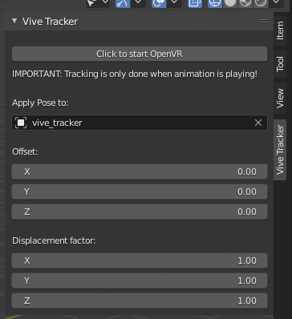

# vive_tracker_blender_addon
Addon for blender that moves an object in the virtual 3d scene based on the actual pose of a vive tracker in reality.



## Installation

1. Setup SteamVR so that the vive tracker is recognized and tracked. At least one lighthouse is required.

2. Install [OpenVR](https://github.com/cmbruns/pyopenvr "openvr library on github") for the version of python that is shipped with blender (which is probably not your main python installation).

## Use

Once installed, the addon provides a new panel in the sidebar on the right of the viewport (open with "n").
To make it work, select an object in the field "Apply Pose to:", then click on "Click to start OpenVR", and finally start the animation playback (space).
At this point the selected object will move in blender like the vive tracker does in reality.

## Troubleshots

* If you don't have/use a headset, the configuration of SteamVR needs to be hacked a bit:
	- in the file path\to\Steam\steamapps\common\SteamVR\drivers\null\resources\settings\defaultvr.vrsettings,
	```
	"enable" : false,			-> change to true
	```

	- in the file path\to\Steam\steamapps\common\SteamVR\resources\settings\defaultvr.vrsettings,
	```
	"steamvr": {
	  "requireHmd": true,			-> change to false
	  "activateMultipleDrivers": false,	-> change o true
	  "forcedDriver": ""			-> change to "null"
	  "enableHomeApp": true,		-> change to false
	```

* For me pyopenvr works but the newer version of the library called pyopenxr doesn't.

* If SteamVR cannot track the bloody vive tracker, try reinstalling completely Steam and SteamVR (was the one and only solution for me).

This was tested with blender 3.2.0 on windows.
Released under GPLv3.0.
